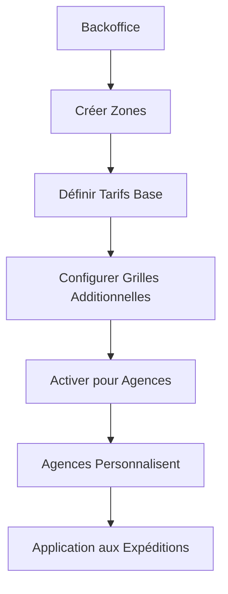
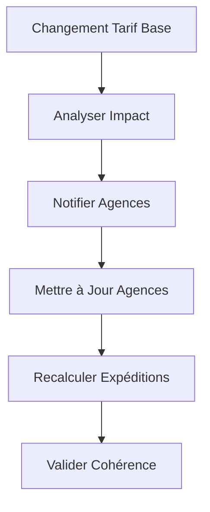
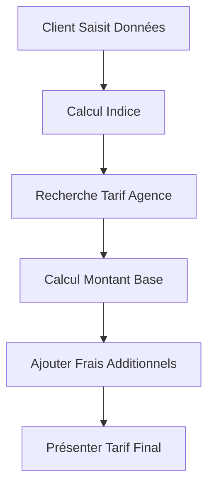

# Workflow d'Enregistrement des Tarifs - TourShop

## 📋 Vue d'ensemble

Ce document décrit le processus complet de gestion tarifaire dans TourShop, de la configuration des tarifs de base par le backoffice à la personnalisation par les agences partenaires.

## 🏗️ Architecture Tarifaire

### Structure Hiérarchique

```
Tarifs de Base (Backoffice)
├── Tarifs Simple
│   └── Par zone + indice + montant_base
├── Tarifs Groupage  
│   └── Par catégorie + pays + modes de transport (avion/bateau/accompagne)
└── Grilles Tarifaires Additionnelles
    ├── Enlèvement domicile
    ├── Livraison domicile
    └── Frais emballage

Tarifs d'Agence (Personnalisés)
├── Tarifs Simple: Pourcentages personnalisés par zone
├── Tarifs Groupage: Pourcentages personnalisés par mode de transport
├── Basés sur tarifs de base
└── Calculs automatiques des montants finaux
```

## 🔄 Workflow Complet

### Phase 1: Configuration des Tarifs de Base (Backoffice)

#### 1.1 Gestion des Zones Géographiques

```php
// Backoffice\ZoneController
POST /api/backoffice/zones
```

**Processus:**
1. **Création des zones hiérarchiques**
   - Pays → Régions → Villes → Zones spécifiques
   - Configuration des relations parent-enfant
   - Définition des niveaux (1: pays, 2: région, etc.)

**Données requises:**
```json
{
    "nom": "France",
    "code": "FR",
    "pays": "France",
    "type": "pays",
    "parent_id": null,
    "niveau": 1,
    "actif": true
}
```

#### 1.2 Configuration des Tarifs Simple

```php
// Backoffice\TarifSimpleController
POST /api/backoffice/tarifs-simple
```

**Processus:**
1. **Définition des tranches d'indice** (poids/volume)
2. **Configuration par zone de destination**
3. **Calcul automatique des montants de prestation**
4. **Validation des prix plancher**

**Données requises:**
```json
{
    "indice": 1.5,
    "mode_expedition": "simple",
    "pays": "États-Unis",
    "prix_zones": [
        {
            "zone_destination_id": "uuid-zone-new-york",
            "montant_base": 15000,
            "pourcentage_prestation": 20
        },
        {
            "zone_destination_id": "uuid-zone-los-angeles", 
            "montant_base": 16000,
            "pourcentage_prestation": 22
        },
        {
            "zone_destination_id": "uuid-zone-chicago",
            "montant_base": 14000,
            "pourcentage_prestation": 18
        }
    ],
    "actif": true
}
```

**Calculs automatiques (côté serveur dans TarifSimple::boot()):**
```php
foreach ($prix_zones as $zone) {
    if (isset($zone['montant_base']) && isset($zone['pourcentage_prestation'])) {
        $zone['montant_prestation'] = round(($zone['montant_base'] * $zone['pourcentage_prestation']) / 100, 2);
        $zone['montant_expedition'] = round($zone['montant_base'] + $zone['montant_prestation'], 2);
    }
}
```

#### 1.3 Configuration des Tarifs Groupage

```php
// Backoffice\TarifGroupageController  
POST /api/backoffice/tarifs-groupage
```

**Processus:**
1. **Définition par catégorie de produits**
2. **Configuration par pays de destination**
3. **Modes de transport multiples** (avion, bateau, accompagné)
4. **Tarif minimum par catégorie**
5. **Prix par mode avec calculs automatiques**

**Données requises:**
```json
{
    "category_id": "uuid-category-electronique",
    "mode_expedition": "groupage",
    "tarif_minimum": 10000,
    "pays": "États-Unis",
    "prix_modes": [
        {
            "mode": "avion",
            "montant_base": 25000,
            "pourcentage_prestation": 25
        },
        {
            "mode": "bateau", 
            "montant_base": 18000,
            "pourcentage_prestation": 20
        },
        {
            "mode": "accompagne",
            "montant_base": 35000,
            "pourcentage_prestation": 30
        }
    ],
    "actif": true
}
```

**Calculs automatiques (côté serveur):**
```php
foreach ($prix_modes as $mode) {
    $mode['montant_prestation'] = round(($mode['montant_base'] * $mode['pourcentage_prestation']) / 100, 2);
    $mode['montant_expedition'] = round($mode['montant_base'] + $mode['montant_prestation'], 2);
}
```

#### 1.4 Configuration des Grilles Additionnelles

##### Enlèvement Domicile
```php
// Backoffice\GrilleTarifaireController
POST /api/backoffice/grilles-tarifaires
```

```json
{
    "type": "enlevement_domicile",
    "zone_depart_id": "uuid-zone-paris",
    "distance_min": 0,
    "distance_max": 5,
    "montant": 1000,
    "devise": "XOF"
}
```

##### Frais d'Emballage
```php
// Backoffice\FraisEmballageController
POST /api/backoffice/frais-emballage
```

```json
{
    "type_emballage": "standard",
    "montant": 500,
    "description": "Emballage carton standard"
}
```

### Phase 2: Personnalisation par les Agences

#### 2.1 Consultation des Tarifs de Base Disponibles

```php
// Agence\TarifSimpleController
GET /api/agence/tarifs-base-disponibles
```

**Processus:**
1. **Filtrage par pays de l'agence**
2. **Affichage des tarifs applicables**
3. **Simulation des prix avec pourcentages par défaut**

**Réponse:**
```json
{
    "success": true,
    "data": [
        {
            "id": "uuid-tarif-simple",
            "indice": 1.5,
            "mode_expedition": "simple",
            "pays": "États-Unis",
            "prix_zones": [
                {
                    "zone_destination_id": "uuid-zone-new-york",
                    "zone_destination": "New York",
                    "montant_base": 15000,
                    "pourcentage_prestation": 20,
                    "montant_prestation": 3000,
                    "montant_expedition": 18000
                },
                {
                    "zone_destination_id": "uuid-zone-los-angeles",
                    "zone_destination": "Los Angeles",
                    "montant_base": 16000,
                    "pourcentage_prestation": 22,
                    "montant_prestation": 3520,
                    "montant_expedition": 19520
                }
            ],
            "actif": true
        }
    ]
}
```

#### 2.2 Création des Tarifs Personnalisés

##### Tarif Simple Personnalisé
```php
// Agence\TarifController
POST /api/agence/add-tarif-simple
```

**Processus:**
1. **Sélection d'un tarif de base**
2. **Récupération automatique des zones configurées**
3. **Personnalisation des pourcentages par zone**
4. **Calcul automatique des montants finaux**

**Données requises:**
```json
{
    "tarif_simple_id": "uuid-tarif-base",
    "prix_zones": [
        {
            "zone_destination_id": "uuid-zone-usa",
            "pourcentage_prestation": 25
        },
        {
            "zone_destination_id": "uuid-zone-uk", 
            "pourcentage_prestation": 22
        },
        {
            "zone_destination_id": "uuid-zone-canada",
            "pourcentage_prestation": 28
        }
    ]
}
```

**Calculs automatiques (TarifAgenceSimple::boot()):**
```php
// Copie automatique de l'indice du tarif simple
if ($model->tarif_simple_id && !$model->indice) {
    $tarifSimple = TarifSimple::find($model->tarif_simple_id);
    if ($tarifSimple) {
        $model->indice = $tarifSimple->indice;
    }
}

// Calcul des montants pour chaque zone
foreach ($prix_zones as &$zone) {
    if (isset($zone['pourcentage_prestation'])) {
        // Récupérer la zone correspondante dans le tarif de base
        $tarifSimple = TarifSimple::find($model->tarif_simple_id);
        if ($tarifSimple) {
            $zoneBase = $tarifSimple->getPrixPourZone($zone['zone_destination_id']);
            if ($zoneBase) {
                $zone['montant_base'] = $zoneBase['montant_base'];
                $zone['montant_prestation'] = round(($zoneBase['montant_base'] * $zone['pourcentage_prestation']) / 100, 2);
                $zone['montant_expedition'] = round($zoneBase['montant_base'] + $zone['montant_prestation'], 2);
            }
        }
    }
}
```

##### Tarif Groupage Personnalisé
```php
// Agence\TarifGroupageController
POST /api/agence/add-tarif-groupage
```

**Processus basé sur les modes de transport:**
```json
{
    "tarif_groupage_id": "uuid-tarif-groupage-base",
    "category_id": "uuid-category-electronique",
    "prix_modes": [
        {
            "mode": "avion",
            "pourcentage_prestation": 30
        },
        {
            "mode": "bateau",
            "pourcentage_prestation": 25
        },
        {
            "mode": "accompagne",
            "pourcentage_prestation": 35
        }
    ]
}
```

**Calculs automatiques (TarifAgenceGroupage):**
```php
// Récupération du tarif de base
$tarifBack = TarifGroupage::find($tarif_groupage_id);
$baseByMode = [];

// Extraction des montants de base par mode
foreach ($tarifBack->prix_modes as $m) {
    $baseByMode[$m['mode']] = $m;
}

// Calcul des montants agence pour chaque mode
foreach ($prix_modes as $mode) {
    $base = $baseByMode[$mode['mode']] ?? null;
    if ($base && isset($base['montant_base'])) {
        $mode['montant_base'] = $base['montant_base'];
        $mode['montant_prestation'] = round(($mode['montant_base'] * $mode['pourcentage_prestation']) / 100, 2);
        $mode['montant_expedition'] = round($mode['montant_base'] + $mode['montant_prestation'], 2);
    }
}
```

#### 2.3 Validation et Sauvegarde

**Contrôles automatiques (TarifAgenceSimple):**
- ✅ **Vérification des pourcentages** (0-100%)
- ✅ **Copie automatique de l'indice** depuis le tarif de base
- ✅ **Validation des zones** (doivent exister dans tarif base)
- ✅ **Calcul des montants** depuis les montants de base
- ✅ **Vérification des doublons** (pas 2 tarifs agence pour même base)
- ✅ **Arrondi des montants** à 2 décimales (PHP_ROUND_HALF_UP)

**Sauvegarde en base:**

*Pour tarifs simples:*
```sql
INSERT INTO tarifs_agence_simple (
    id, agence_id, tarif_simple_id, prix_zones, actif, created_at, updated_at
) VALUES (
    uuid, uuid_agence, uuid_tarif_base, 
    '[{zone_destination_id, montant_base, pourcentage_prestation_agence, montant_prestation_agence, montant_expedition_agence}]',
    true, now(), now()
);
```

*Pour tarifs groupage:*
```sql
INSERT INTO tarifs_agence_groupage (
    id, agence_id, tarif_groupage_id, category_id, prix_modes, actif, created_at, updated_at
) VALUES (
    uuid, uuid_agence, uuid_tarif_groupage_base, uuid_category,
    '[{mode, montant_base, pourcentage_prestation, montant_prestation, montant_expedition}]',
    true, now(), now()
);
```

### Phase 3: Utilisation des Tarifs

#### 3.1 Simulation de Tarification

```php
// ClientExpeditionController@simulate
POST /api/client/expeditions/simulate
```

**Processus:**
1. **Récupération des articles et dimensions**
2. **Calcul de l'indice de tranche** (poids ou volume)
3. **Recherche du tarif agence applicable**
4. **Calcul du tarif final avec tous les frais**

**Algorithme de calcul:**

*Pour mode simple:*
```php
// 1. Calcul de l'indice (arrondi à 1 décimale)
$indice = round(max(
    $poids_total / $poids_unite,
    $volume_total / $volume_unite
), 1);

// 2. Recherche tarif agence simple avec scope optimisé
$tarifAgence = TarifAgenceSimple::pourCriteres(
    $agence_id, 
    $zone_destination_id, 
    'simple', 
    $indice
)->first();

// 3. Calcul montant expédition
if ($tarifAgence) {
    $prixZone = $tarifAgence->getPrixPourZone($zone_destination_id);
    $montant_expedition = $prixZone['montant_expedition'] ?? 0;
}
```

*Pour mode groupage:*
```php
// 1. Détection de la catégorie principale des articles
$category_id = $this->detectCategory($articles);

// 2. Recherche tarif agence groupage
$tarifAgence = TarifAgenceGroupage::where('agence_id', $agence_id)
    ->where('category_id', $category_id)
    ->whereHas('tarifGroupage', function($query) use ($pays_destination) {
        $query->where('pays', $pays_destination);
    })
    ->first();

// 3. Sélection du mode de transport (choix client ou le plus économique)
$mode_transport = $client_choix ?? $this->getModeEconomique($tarifAgence);

// 4. Calcul montant expédition selon mode
$montant_expedition = $tarifAgence->getMontantForMode($mode_transport);
```

*Ajout des frais additionnels:*
```php
$frais_enlevement = $this->calculFraisEnlevement($distance_km);
$frais_livraison = $this->calculFraisLivraison($distance_km);
$frais_emballage = $this->getFraisEmballage($type_emballage);

$montant_total = $montant_expedition + $frais_enlevement + $frais_livraison + $frais_emballage;
```

#### 3.2 Application aux Expéditions

```php
// ExpeditionTarificationService
public function calculerTarifExpedition(Expedition $expedition)
{
    // Récupération du tarif applicable
    $tarifApplicable = $this->getTarifApplicable($expedition);
    
    // Calcul du montant de base
    $montantBase = $tarifApplicable->getMontantForZone($expedition->zone_destination_id);
    
    // Calcul des frais additionnels
    $fraisAdditionnels = $this->calculerFraisAdditionnels($expedition);
    
    // Montant final
    $montantTotal = $montantBase + $fraisAdditionnels;
    
    // Mise à jour de l'expédition
    $expedition->update([
        'montant_base' => $montantBase,
        'montant_total_expedition' => $montantTotal
    ]);
}
```

## 📊 Gestion et Maintenance

### 4.1 Mise à Jour des Tarifs de Base

```php
// Backoffice\TarifSimpleController@edit
PUT /api/backoffice/tarifs-simple/{id}
```

**Impact sur les tarifs agence:**
- ⚠️ **Notification automatique** aux agences concernées
- 🔄 **Recalcul automatique** des tarifs agence si nécessaire
- 📧 **Email d'information** sur les changements

**Processus de mise à jour:**
1. **Vérification de l'impact** (combien d'agences affectées)
2. **Validation des nouveaux montants** (pas en dessous des coûts)
3. **Application progressive** (optionnelle)
4. **Historisation des changements**

### 4.2 Synchronisation des Tarifs

```php
// Commande artisan
php artisan tarifs:sync-agences
```

**Processus:**
1. **Détection des incohérences** entre tarifs base et agences
2. **Recalcul automatique** des montants obsolètes
3. **Notification des agences** des tarifs mis à jour
4. **Génération de rapports** de synchronisation

### 4.3 Validation des Tarifs

```php
// Commande artisan
php artisan tarifs:validate
```

**Contrôles effectués:**
- ✅ **Cohérence des montants** (base + marge = final)
- ✅ **Disponibilité des zones** (toutes les zones ont des tarifs)
- ✅ **Absence de doublons** (pas de conflits)
- ✅ **Limites de pourcentages** (valeurs réalistes)

## 🔄 Workflows Spécifiques

### Workflow de Création Rapide



### Workflow de Mise à Jour



### Workflow de Simulation



## 📈 Reporting et Analytics

### Statistiques Tarifaires

```php
// Backoffice\TarifController@statistics
GET /api/backoffice/tarifs/statistics
```

**Métriques disponibles:**
- **Nombre de tarifs par zone**
- **Moyenne des pourcentages agence**
- **Écart par rapport aux tarifs base**
- **Tarifs les plus utilisés**
- **Revenus par type de tarif**

### Performance des Tarifs

```php
// Commande artisan
php artisan tarifs:performance-report
```

**Indicateurs:**
- **Taux d'utilisation** des tarifs personnalisés vs base
- **Temps de calcul** moyen des tarifications
- **Précision des simulations** vs réel
- **Satisfaction client** sur les prix

## 🛠️ Outils d'Administration

### Import/Export de Tarifs

```php
// Backoffice\TarifImportController
POST /api/backoffice/tarifs/import
```

**Format CSV/Excel supporté:**
```csv
zone_destination,indice_tranche,montant_base,pourcentage_prestation
USA,1.0,15000,20
UK,1.0,12000,18
CANADA,1.0,14000,22
```

### Validation en Masse

```php
// Commande artisan
php artisan tarifs:validate-all --fix
```

**Options:**
- `--dry-run` : Validation sans modification
- `--fix` : Correction automatique des erreurs
- `--report` : Génération de rapport détaillé

## 🔧 Configuration Système

### Variables d'Environnement

```env
# Tarification
TARIF_MARGE_MINIMUM=5
TARIF_MARGE_MAXIMUM=50
TARIF_CALCUL_CACHE_TTL=3600

# Grilles tarifaires
FRAIS_ENLEVEMENT_BASE=1000
FRAIS_LIVRAISON_BASE=1500
FRAIS_EMBALLAGE_STANDARD=500

# Notifications
NOTIFICATION_TARIF_CHANGEMENT=true
NOTIFICATION_TARIF_SYNC=true
```

### Jobs en Arrière-Plan

```php
// App\Jobs\TarifSyncJob
class TarifSyncJob implements ShouldQueue
{
    public function handle()
    {
        // Synchronisation des tarifs agence
        // Recalcul des montants
        // Notifications
    }
}
```

## ✅ Bonnes Pratiques

### Pour le Backoffice
1. **Documenter les changements** avec motifs clairs
2. **Tester les impacts** avant application
3. **Notifier proactivement** les agences
4. **Maintenir l'historique** des tarifs

### Pour les Agences
1. **Personnaliser judicieusement** les pourcentages
2. **Surveiller la concurrence** locale
3. **Adapter régulièrement** les tarifs
4. **Simuler avant application**

### Pour les Développeurs
1. **Valider systématiquement** les calculs
2. **Logger les opérations** tarifaires
3. **Optimiser les requêtes** fréquentes
4. **Mettre en cache** les résultats complexes

---

*Ce workflow garantit une gestion tarifaire robuste, flexible et performante pour l'écosystème TourShop.*
